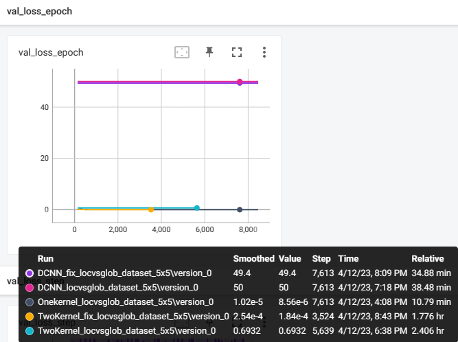
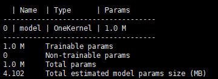
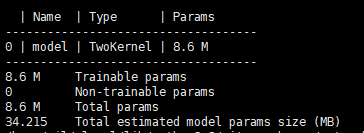
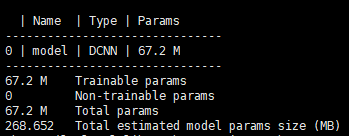

# CNN卷积核局部与全局信息提取能力测试实验

## Result

### Table:Whether the model converges

| Dataset            | OneKernel | TwoKernels | DCNN |
| ------------------ | --------- | ---------- | ---- |
| Random Middle Area | √        | ×         | ×   |
| Fix Mmiddle Area   | √        |            | √   |
| Cats and Dogs      |           |            | √   |

### LOSS

## model

### Onekernel

### Twokernels

(730,000,000 FLOPs)

### DCNN

(3350,000,000,000 FLOPs)

## DataSet

> Random_middle_Area -- dataset.py
>
> Fix_middle_Area -- dataset.py
>
> CatvsDog -- [Cat and Dog | Kaggle](https://www.kaggle.com/datasets/tongpython/cat-and-dog)
