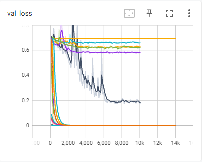
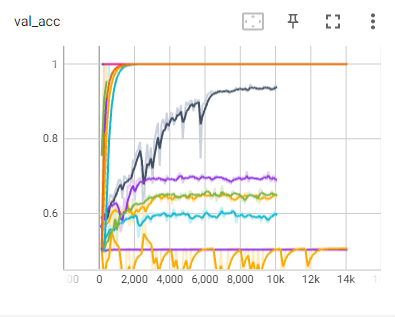
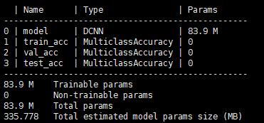
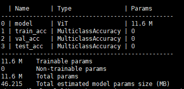
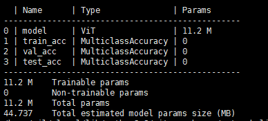

# CNN卷积核局部与全局信息提取能力测试实验

## Result

### Table1:Whether the model converges

| Dataset            | OneKernel | TwoKernels | DCNN | ViT_18 | ViT_36 |
| ------------------ | --------- | ---------- | ---- | ------ | ------ |
| Random Middle Area | √        | ×         | ×   | √     | √     |
| Fix Middle Area    | √        | √         | √   | √     | √     |
| None Middle Area   | √        | √         | √   | √     | √     |
| Cats and Dogs      | ⍻        | ⍻         | √   | ⍻     | ⍻     |

### LOSS

### Accuracy

## model

### Onekernel

### Twokernels

(730,000,000 FLOPs)

### DCNN

(3350,000,000,000 FLOPs)

### ViT_36

### ViT_18

## DataSet

> Random_middle_Area -- dataset.py
>
> Fix_middle_Area -- dataset.py
>
> None_middle_Area -- dataset.py
>
> CatvsDog -- [Cat and Dog | Kaggle](https://www.kaggle.com/datasets/tongpython/cat-and-dog)

## Others

### Table2:5x5的画布上实验结果：

|               | OneKernel            | TwoKernel                  |
| ------------- | -------------------- | -------------------------- |
| Description_0 | 仅用5x5的1通道卷积核 | 仅用两个3x3的1通道的卷积核 |
| Result_0      | 收敛，但不完美收敛   | 不收敛                     |
| Description_1 |                      | 用两个3x3的4通道卷积核     |
| Results_1     |                      | 收敛，但不完美收敛         |
| Description_2 | 用5x5的32通道卷积核  | 用两个3x3的32通道的卷积核  |
| Results_2     | 完美收敛             | 完美收敛                   |

#### conclusion:

按理论公式推理，仅在一个通道的情况下，用一个5x5的1通道卷积核结果是会收敛的，用两个3x3的1通道卷积核结果是不会收敛的，实验证明也是如此。

但当通道数增加时，两者都完美收敛，这个结果说明模型的参数组（一个通道卷积核代表一组参数组）增多，会增加模型的拟合能力，从而减小中心区域像素点对对角区域像素点的影响。

### Table3:179x179的Random Middle Area数据集实验结果：（实验灵感来自Tab2）

|               | TwoKernel_layer1_128                            | DCNN_layer1_128                                 |
| ------------- | ----------------------------------------------- | ----------------------------------------------- |
| Description_0 | 这里将原来模型的第一层卷积核通道数从64增加到128 | 这里将原来模型的第一层卷积核通道数从64增加到128 |
| Result_0      | 不收敛                                          | 完美收敛                                        |
| Description_1 | 这里将原来模型的第一层卷积核通道数从64增加到256 |                                                 |
| Result_1      | 完美收敛                                        |                                                 |

#### conclution:

增加第一层卷积核的通道数，即增加模型的参数组，会增强模型的拟合能力。

## Summary:

对比Tab1和Tab2：当图片尺寸增大时，图片中心区域像素对图片对角区域像素影响增大

对比Tab1和Tab3：图片中心区域像素对图片对角区域像素影响主要来自于模型第一层没有有效拟合，增加第一层卷积核通道数可以有效改善这个问题
